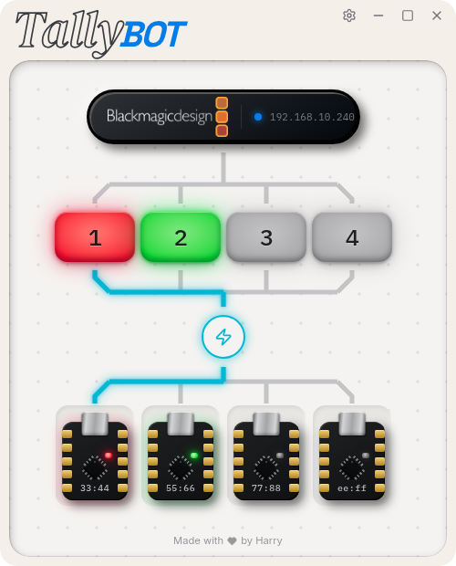

<p align="center">
  <br/>
  <a href="LICENSE.md"></a>
  <a href="https://github.com/bluescorpian/tallybot/actions/workflows/ci.yml"></a>
  
  <br/>
  <br/>
</p>

<h1 align="center">TallyBot</h1>
<h3 align="center">Wireless camera tally lights for Blackmagic ATEM switchers</h3>
<br/>

<p align="center">
  
</p>
<br/>

<p align="center">
  <a href="#features">Features</a> ·
  <a href="#how-it-works">How it works</a> ·
  <a href="#hardware">Hardware</a> ·
  <a href="#getting-started">Getting started</a> ·
  <a href="#development">Development</a>
</p>

TallyBot turns a tiny ESP32-C3 board into a camera tally light. A desktop app on the
streaming PC watches your **ATEM Mini** and tells every light what to show: **red** when
its camera is live, **green** on preview, **dim white** when idle. Camera operators know
where they stand at a glance, and nobody has to touch anything during the show.

It was built for a church video team and is meant for any small live production: no
soldering, no hardcoded IP addresses, no per-device configuration files.

> [!NOTE]
> TallyBot supports **Linux and Windows**. macOS is out of scope.

## Features

- **Instant tally** from the ATEM's program and preview buses, with input names mirrored
  straight from the switcher.
- **Zero network setup.** Lights and the app find each other automatically.
- **Three ways to connect** each light: over WiFi, over ESP-NOW (no router needed), or
  over a USB-C cable.
- **Plug in to provision.** Connect a light by USB-C and the app detects it, then lets you
  choose how it talks once unplugged.
- **Flash to identify.** Click a light in the app and the physical LED strobes, so you
  always know which one is which.
- **Several lights per camera**, for example one facing the operator and one facing the
  presenter.
- **Honest failure states.** A light never pretends to be idle when it has lost the
  switcher: it flashes blue instead, so a dropped connection is never mistaken for "safe
  to move".

| | WiFi | ESP-NOW | USB-C |
| :-- | :--: | :--: | :--: |
| Needs a WiFi network | Yes | No | No |
| Needs a cable to the PC | No | One bridge dongle | Yes |
| Automatic discovery | Yes | Yes | Yes |
| Best for | Venues with reliable WiFi | Venues without it | Bench testing, fixed positions |

## How it works

```
ATEM Mini ──UDP 9910──▶ TallyBot app ──WiFi / ESP-NOW / USB──▶ ESP32-C3 ──▶ RGB LED
```

The desktop app (Tauri + SvelteKit, with a Node.js backend) connects to the ATEM,
translates its state into a colour per light, and streams those colours out. Lights are
deliberately simple: they render what they are told, so behaviour lives in the app where
it is easy to change.

On WiFi, lights discover the app by UDP broadcast, which means the PC and the lights must
share a subnet. On ESP-NOW, one USB-connected board acts as a bridge and relays tally to
the rest over the radio, with no router involved.

## Hardware

| Part | Notes |
| :-- | :-- |
| **ESP32-C3 SuperMini V2** | Has an onboard WS2812 RGB LED on GPIO8, so the bare board is a complete tally light. |
| **USB-C power bank** | The firmware never sleeps, so the bank's low-current auto-off won't cut power mid-show. |
| **Blackmagic ATEM Mini** | Any model the [`atem-connection`](https://github.com/nrkno/sofie-atem-connection) library supports. |

## Getting started

### 1. Run the app

TallyBot is currently built from source. On NixOS, `flake.nix` provides the whole
toolchain (`direnv allow`, or `nix develop`). Elsewhere, install the
[Tauri prerequisites](https://tauri.app/start/prerequisites/), Node.js and pnpm.

```bash
cd app
pnpm install
cargo tauri dev        # builds and runs the desktop app
```

For a portable Windows build, run [`scripts/win-build.ps1`](scripts/win-build.ps1) in an
elevated PowerShell. It installs the prerequisites and produces a zip.

### 2. Flash a light

Flashing needs [PlatformIO](https://platformio.org/) for now; in-app flashing is planned.

```bash
cd firmware
pio run -e esp32-c3-release -t upload
```

### 3. Provision and assign

Plug the flashed light into the PC by USB-C. The app detects it and asks how it should
connect once unplugged (WiFi, ESP-NOW or USB only). Unplug it, power it from a battery,
and assign it to an ATEM input. Until it is assigned it breathes white, so you can see it
is alive and waiting.

In the field, without a PC to hand, a light can also switch WiFi networks on its own: hold
its BOOT button and it raises a `TallyLight-XXXXXX` hotspot with a setup page at
`192.168.4.1`.

> [!TIP]
> **Linux:** if the app can't open a light's USB port, add yourself to the `dialout`
> group (`uucp` on Arch) and log back in.

### No hardware?

[`tools/`](tools/README.md) has simulators for the ATEM and for tally lights, so you can
run the whole system on one machine.

## Light colours

| Colour | Meaning |
| :-- | :-- |
| 🔴 Red | Live (on program) |
| 🟢 Green | On preview |
| ⚪ Dim white | Idle |
| ⚪ White, breathing | Connected but not assigned to an input |
| 🔵 Blue, steady | Lost the app (check the PC) |
| 🔵 Blue, flashing | Connected, but the app has lost the switcher |

## Development

| Guide | What it covers |
| :-- | :-- |
| [`app/sidecar/README.md`](app/sidecar/README.md) | Running and testing the Node.js backend on its own |
| [`app/sidecar/SIDECAR.md`](app/sidecar/SIDECAR.md) | How the backend runs alongside the Tauri shell |
| [`firmware/README.md`](firmware/README.md) | Building and flashing the ESP32-C3 firmware |
| [`tools/README.md`](tools/README.md) | ATEM and tally-light simulators for hardware-free testing |

## License

TallyBot is released under the [PolyForm Noncommercial License 1.0.0](LICENSE.md). You're
free to use, modify and share it for any noncommercial purpose, including churches,
schools and other nonprofits.
